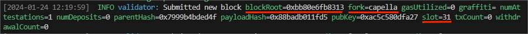
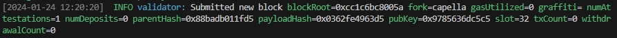
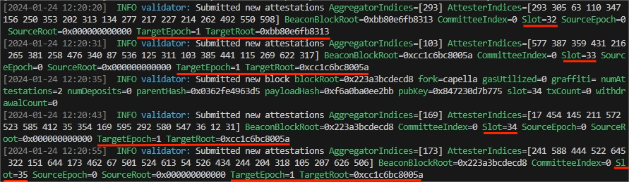
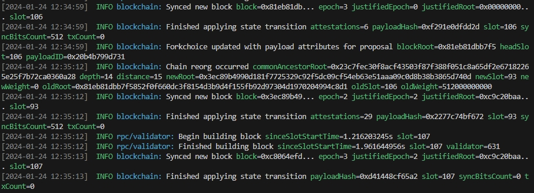
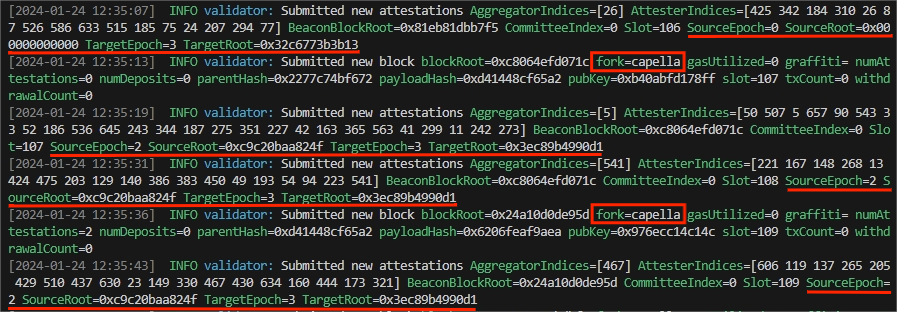

# Staircase Attack

 This is the staircase attack using the newest Prysm implementation (V4.2.0). 

### Feasibility of Warm-up Attack

	
    

    
     
     Figure 1: Block 31 with root 0xbb. 
    

	
    

    
     
     Figure 2: Block 32 with root 0xcc. 
    

	
    

    
     
     Figure 3: Attestations from honest validators in slots 32 to 35. 
    

### Staircase Attack with Latest Version

	
    

    
     
     Figure 4: Reorganization. 
    

	
    

    
     
     Figure 5: Attestations from honest validators before and after reorganization. It can be seen that the fork is Capella.  
    

